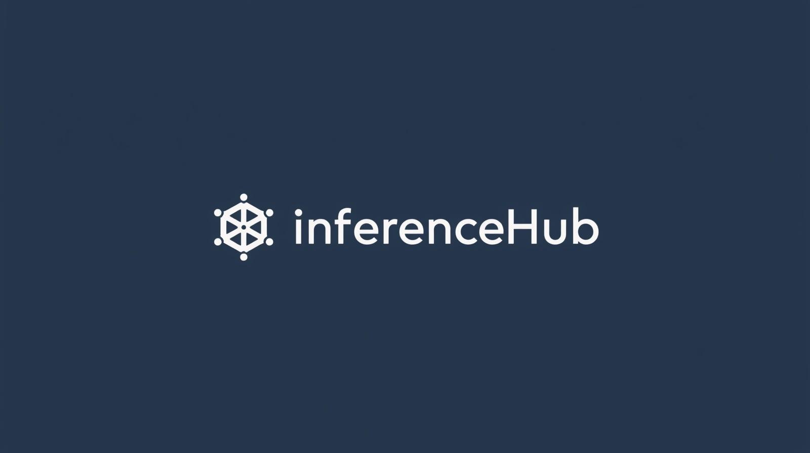
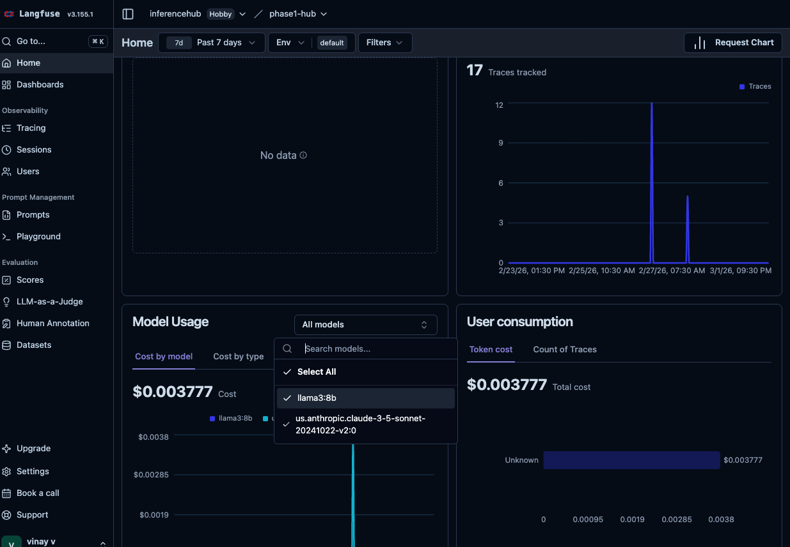

# InferenceHub



InferenceHub is a Kubernetes-native CLI that deploys, wires, and governs a self-hosted LLM stack on your cluster.<br/>
It is Self-hosted. Open-source. Designed for Kubernetes environments. <br/>

[](https://www.apache.org/licenses/LICENSE-2.0)

## What InferenceHub Provisions

**Application stack** — versions are configurable via `versions:` in `inferencehub.yaml`:

| Component | Role |
|-----------|------|
| [OpenWebUI](https://github.com/open-webui/open-webui) | ChatGPT-style web interface for interacting with LLMs |
| [LiteLLM](https://github.com/BerriAI/litellm) | OpenAI-compatible API gateway routing to 2000+ model providers |
| [PostgreSQL](https://hub.docker.com/_/postgres) | Persistent storage for users, conversations, and configuration |
| [Redis](https://hub.docker.com/_/redis) | Two separate instances: session state (OpenWebUI) and API response caching (LiteLLM) |
| [SearXNG](https://github.com/searxng/searxng) | Self-hosted web search engine for OpenWebUI (optional) |

**Infrastructure** — versions pinned by the prerequisites script:

| Component | Version | Role |
|-----------|---------|------|
| [Envoy Gateway](https://github.com/envoyproxy/gateway) | `v1.7.0` | Kubernetes Gateway API implementation |
| [cert-manager](https://github.com/cert-manager/cert-manager) | `v1.19.4` | Automatic TLS via Let's Encrypt |
| [AWS Load Balancer Controller](https://github.com/kubernetes-sigs/aws-load-balancer-controller) | `3.1.0` | NLB provisioning on AWS EKS (optional) |
| [Langfuse](https://langfuse.com) | SaaS | LLM observability and cost tracking (optional) |

## Why InferenceHub?

**InferenceHub is an infrastructure layer provisioner that helps you to create and manage your Internal AI platform via cli**

Running LLM tools inside Kubernetes often requires stitching together a UI layer, API gateway, storage, caching, and observability — each configured separately. <br/>

InferenceHub standardizes this stack into a single, opinionated deployment, reducing operational overhead and configuration drift. <br/>

This project is early-stage and aims to evolve into a declarative internal AI platform for organizations running LLM workloads on Kubernetes. <br/>


## Vision

>*InferenceHub aims to provide declarative model management, team isolation, and first-class RAG primitives as part of the platform.*

## How it works


## Cloud provider support

> **v0.2.0 is tested and supported on AWS EKS.** The Helm chart is cloud-agnostic, but the prerequisites script, NLB configuration, IRSA integration, and storage class defaults are built and validated for AWS. Other providers are on the roadmap.

| Provider | Status | Notes |
|----------|--------|-------|
| **AWS EKS** | ✅ Supported | NLB via Envoy Gateway, IRSA for Bedrock, gp3 storage |
| GKE | 🔜 Planned | Cloud Load Balancer, Workload Identity |
| AKS | 🔜 Planned | Azure Load Balancer, Workload Identity |
| Local / kind | ⚠️ Best effort | No cloud-specific features; works for development |

## Requirements

- Kubernetes cluster (EKS recommended; see [cloud provider support](#cloud-provider-support) above)
- `kubectl` and `helm` installed locally
- `LITELLM_MASTER_KEY` environment variable set (must start with `sk-`)

## Quick start

### 1. Install cluster prerequisites _(skip if already present)_

If your cluster already has **Gateway API CRDs**, **cert-manager**, **Envoy Gateway**, and a **Gateway resource**, skip this step and go straight to step 2.

Otherwise, run once per cluster:

```
python3 scripts/setup-prerequisites.py \
  --cluster-name my-cluster \
  --domain inferencehub.ai \
  --environment prod \
  --tls-email admin@inferencehub.ai
```

This installs: Gateway API CRDs, cert-manager, Envoy Gateway, GatewayClass, Gateway, and optionally the AWS Load Balancer Controller.

See [docs/prerequisites.md](docs/prerequisites.md) for full options.

### 2. Install the CLI locally

InferenceHub is written in Go. You can build and install it to your `$GOPATH/bin` (make sure your Go path is in your `$PATH`).

```bash
cd inferencehub-cli
make install
cd ..
```

Verify installation:
```bash
inferencehub --version
```

### 3. Create a config file

Run all `inferencehub` commands from the **project root** (the directory that contains `helm/` and `scripts/`). The CLI creates `inferencehub.yaml` and reads `.env` from your current directory.

```bash
# Make sure you're at the project root
inferencehub config init
```

Edit the generated `inferencehub.yaml`:

```yaml
clusterName: my-cluster
domain: inferencehub.ai
environment: staging
namespace: inferencehub
cloudProvider: aws        # auto-selects helm/inferencehub/values-aws.yaml

gateway:
  name: inferencehub-gateway
  namespace: envoy-gateway-system

models:
  bedrock:
    - name: claude-sonnet
      model: anthropic.claude-3-5-sonnet-20241022-v2:0
      region: us-east-1

# IAM role for the LiteLLM service account — required for Bedrock access
aws:
  litellmRoleArn: "arn:aws:iam::123456789012:role/litellm-bedrock-role"

observability:
  enabled: false
  langfuse:
    host: https://cloud.langfuse.com
    publicKey: "${LANGFUSE_PUBLIC_KEY}"
    secretKey: "${LANGFUSE_SECRET_KEY}"

# Optional: enable web search in OpenWebUI
# Deploys SearXNG in-cluster by default. To use an external engine, set external.enabled: true.
# webSearch:
#   enabled: true
#   engine: searxng          # searxng (default) | brave | bing | tavily | google_pse | duckduckgo
#   external:
#     enabled: false         # set true to use your own engine instead of in-cluster SearXNG
#     queryUrl: ""           # for searxng: https://searxng.example.com/search?q=<query>&format=json
#     apiKey: "${API_KEY}"   # for brave / bing / tavily / google_pse
#     engineId: ""           # for google_pse only

# Optional: pass any open-webui chart value through directly
# openwebui:
#   sso:
#     enabled: true

# Optional: pass any litellm-helm chart value through directly
# litellm:
#   proxy_config:
#     litellm_settings:
#       request_timeout: 600
```

See [docs/configuration.md](docs/configuration.md) for the full schema.

### 4. Set environment variables

```bash
export LITELLM_MASTER_KEY="sk-your-secret-key"
# optional
export LANGFUSE_PUBLIC_KEY="pk-lf-..."
export LANGFUSE_SECRET_KEY="sk-lf-..."
```

Use a `.env` file — the CLI auto-loads `.env`, `.env.local`, and `~/.inferencehub/.env`.

### 5. Point DNS before installing

> [!CAUTION]
> **Set up your DNS record before running `inferencehub install`.** The installer deploys cert-manager, which immediately attempts an HTTP-01 ACME challenge to issue a TLS certificate. If your domain does not resolve to the load balancer at that point, the challenge fails and cert-manager enters a backoff loop that requires manual intervention to clear.

After the prerequisites script completes, get the NLB hostname:

```bash
kubectl get gateway inferencehub-gateway -n envoy-gateway-system \
  -o jsonpath='{.status.addresses[0].value}'
```

Then in your DNS provider, create a **CNAME** record before proceeding:

```
inferencehub.platformaiq.com  →  CNAME  →  <nlb-hostname>.elb.amazonaws.com
```

Verify propagation before continuing:

```bash
dig inferencehub.platformaiq.com @8.8.8.8 +short
# Must return an IP or CNAME — if empty, wait and retry
```

### 6. Install

```bash
inferencehub install --config inferencehub.yaml
```

When `cloudProvider: aws` is set in your config, the CLI automatically uses `helm/inferencehub/values-aws.yaml` (gp3 storage) and annotates the LiteLLM service account with `aws.litellmRoleArn` for Bedrock IRSA — no manual values file editing required.

### 7. Verify

```bash
inferencehub verify
inferencehub status
```

## Web search

InferenceHub can enable web search inside OpenWebUI. By default it deploys **SearXNG** — a free, self-hosted, open-source metasearch engine — inside the cluster. No external account or API key required.

### In-cluster SearXNG (default)

```yaml
webSearch:
  enabled: true
```

A SearXNG pod is deployed alongside the rest of the stack and wired to OpenWebUI automatically. No further configuration needed.

### External SearXNG instance

Point OpenWebUI at an existing SearXNG deployment:

```yaml
webSearch:
  enabled: true
  external:
    enabled: true
    queryUrl: "https://searxng.example.com/search?q=<query>&format=json"
```

### External API-key engine

Use a third-party search API instead. Set `engine` to one of the supported values and supply credentials:

| Engine | `engine` value | Required credential |
|--------|---------------|---------------------|
| Brave Search | `brave` | `apiKey` |
| Bing | `bing` | `apiKey` |
| Tavily | `tavily` | `apiKey` |
| Google PSE | `google_pse` | `apiKey` + `engineId` |
| DuckDuckGo | `duckduckgo` | _(none)_ |

```yaml
webSearch:
  enabled: true
  engine: brave
  external:
    enabled: true
    apiKey: "${BRAVE_API_KEY}"
```

Credentials support `${ENV_VAR}` interpolation — keep them out of `inferencehub.yaml` and export them before running the CLI.

## Troubleshooting: site not accessible after install

If pods are running but your domain isn't loading, the most common cause is a **TLS certificate that hasn't been issued yet**. Work through these checks in order.

### Check certificate status

```bash
kubectl get certificate -n inferencehub
```

The `READY` column must be `True`. If it shows `False`, continue below.

### Check the full issuance chain

```bash
kubectl get certificate,certificaterequest,order,challenge -n inferencehub
```

Every resource in this chain must reach a terminal ready/approved state:

| Resource | Healthy state |
|----------|--------------|
| `Certificate` | `READY = True` |
| `CertificateRequest` | `APPROVED = True`, `READY = True` |
| `Order` | `STATE = valid` |
| `Challenge` | `STATE = valid` (deleted once complete) |

### Diagnose a stuck resource

```bash
# Describe whichever resource is not healthy
kubectl describe certificate inferencehub-tls -n inferencehub
kubectl describe certificaterequest -n inferencehub
kubectl describe order -n inferencehub
kubectl describe challenge -n inferencehub
```

The `Events` section at the bottom will show the exact failure reason.

### Common failure: DNS not propagated

```
DNS problem: NXDOMAIN looking up A for <domain>
```

The ACME server could not resolve your domain. Check:

```bash
dig <your-domain> @8.8.8.8 +short   # must return an IP or CNAME
```

If empty, your DNS record hasn't propagated yet. Wait and then force a retry:

```bash
kubectl delete certificaterequest -n inferencehub --all
# cert-manager recreates it automatically within seconds
```

### Common failure: order stuck in invalid state

```bash
# Delete the failed order — cert-manager recreates it from the CertificateRequest
kubectl delete order -n inferencehub --all
```

If cert-manager does not recreate the CertificateRequest automatically, delete the Certificate and re-apply:

```bash
kubectl delete certificate inferencehub-tls -n inferencehub
inferencehub upgrade --config inferencehub.yaml
```

## CLI reference

| Command | Description |
|---------|-------------|
| `inferencehub config init` | Generate a starter config file |
| `inferencehub config validate --config <file>` | Validate config and env vars |
| `inferencehub config show --config <file>` | Show config after env var interpolation |
| `inferencehub install --config <file>` | Install the platform |
| `inferencehub upgrade --config <file>` | Upgrade an existing installation |
| `inferencehub status` | Show component health |
| `inferencehub verify` | Check prerequisites and platform |
| `inferencehub uninstall --confirm` | Remove the platform |

Run `inferencehub <command> --help` for all flags.

## Supported model providers

| Provider | Example model ID |
|----------|-----------------|
| AWS Bedrock | `anthropic.claude-3-5-sonnet-20241022-v2:0` |
| OpenAI | `gpt-4o` |
| Ollama (self-hosted) | `llama3.2:3b` |
| Azure OpenAI | `gpt-4` |

## Project layout

```
inference-platform/
├── helm/
│   └── inferencehub/          # The Helm chart
│       ├── Chart.yaml
│       ├── Chart.lock
│       ├── charts/             # Subchart tarballs (open-webui, litellm-helm)
│       ├── values.yaml         # Defaults
│       ├── values-aws.yaml     # AWS preset (gp3 storage) — auto-selected, do not edit
│       ├── values-local.yaml   # Local/kind overrides
│       └── templates/
│           ├── litellm/        # Master key secret + wiring env secret
│           ├── postgresql/     # StatefulSet, Service, Secret, init ConfigMap
│           ├── redis/
│           ├── searxng/        # Deployment, Service, ConfigMap (when webSearch.enabled)
│           └── networking/     # HTTPRoute, Certificate, ReferenceGrant
├── scripts/
│   ├── setup-prerequisites.py    # Install cluster-wide components
│   └── uninstall-prerequisites.py
├── inferencehub-cli/             # CLI source code (Go)
├── examples/
│   ├── config-aws.yaml
│   ├── config-local.yaml
│   └── .env.example
└── docs/
    ├── prerequisites.md
    ├── configuration.md
    └── upgrading/
        ├── v0.1-to-v0.2.md
        └── migrate-database.sh
```

## Documentation

- [Prerequisites setup](docs/prerequisites.md) — Install cluster-wide components
- [Configuration reference](docs/configuration.md) — Full `config.yaml` schema
- [Infrastructure model](docs/infrastructure.md) — How InferenceHub manages PostgreSQL and Redis
- [AWS deployment](docs/prerequisites.md#aws-load-balancer-controller) — EKS-specific setup


## Demo

[](https://asciinema.org/a/3mcWdditQI1ZlNlU)


## LangFuse integration



## Contributing

1. Fork the repository
2. Create a feature branch
3. Run `cd helm/inferencehub && helm dep build` to install subchart dependencies
4. Run `helm lint helm/inferencehub/` to validate chart changes
5. Run `cd inferencehub-cli && go build ./...` to validate CLI changes
6. Open a pull request

Refer to [Guide](./CONTRIBUTING.md) for more details

## License

Apache — see [LICENSE](LICENSE).
