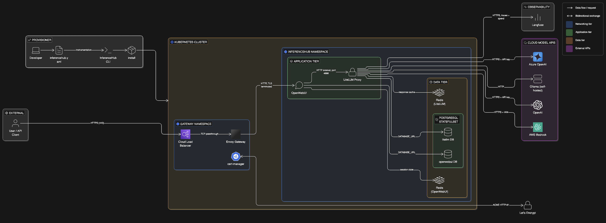

# InferenceHub

Deploy and manage a **self-hosted AI platform on Kubernetes**.

---

## What is InferenceHub?

InferenceHub standardizes the LLM infrastructure stack into a single, opinionated deployment — eliminating the need to manually wire together a chat UI(optional), API gateway, databases, caching, and observability. As of today this acts as an infrastructure layer provisioner that helps you to create and manage your Internal AI platform via cli.

> **InferenceHub is an infrastructure layer provisioner that helps you to create and manage your Internal AI platform via cli.**

## What's included

**Application stack** — versions are configurable via `versions:` in `inferencehub.yaml`:

| Component | Role |
|-----------|------|
| [OpenWebUI](https://github.com/open-webui/open-webui) | ChatGPT-style web interface |
| [LiteLLM](https://github.com/BerriAI/litellm) | OpenAI-compatible API gateway (2000+ providers) |
| [PostgreSQL](https://hub.docker.com/_/postgres) | Persistent storage for users, conversations, config |
| [Redis](https://hub.docker.com/_/redis) | Session state (OpenWebUI) + API cache (LiteLLM) |
| [SearXNG](https://github.com/searxng/searxng) | Self-hosted web search engine (optional) |

**Infrastructure** — versions pinned by the prerequisites:

| Component | Version | Role |
|-----------|---------|------|
| [Envoy Gateway](https://github.com/envoyproxy/gateway) | `v1.7.0` | Kubernetes Gateway API implementation |
| [cert-manager](https://github.com/cert-manager/cert-manager) | `v1.19.4` | Automatic TLS via Let's Encrypt |
| [AWS Load Balancer Controller](https://github.com/kubernetes-sigs/aws-load-balancer-controller) | `3.1.0` | NLB provisioning on AWS EKS (optional) |
| [Langfuse](https://langfuse.com) | SaaS | LLM observability and cost tracking (optional) |

## Cloud provider support

| Provider | Status | Notes |
|----------|--------|-------|
| **AWS EKS** | Supported | TLS termination via Envoy Gateway, IRSA for Model access |
| GKE | Planned | Cloud Load Balancer, Workload Identity |
| AKS | Planned | Azure Load Balancer, Managed Identity |
| Local / kind | Best effort | No cloud-specific features; works for development |

## Demo

## License

Apache 2.0 — see [LICENSE](https://github.com/Vinay-Venkatesh/inference-hub/blob/main/LICENSE).
